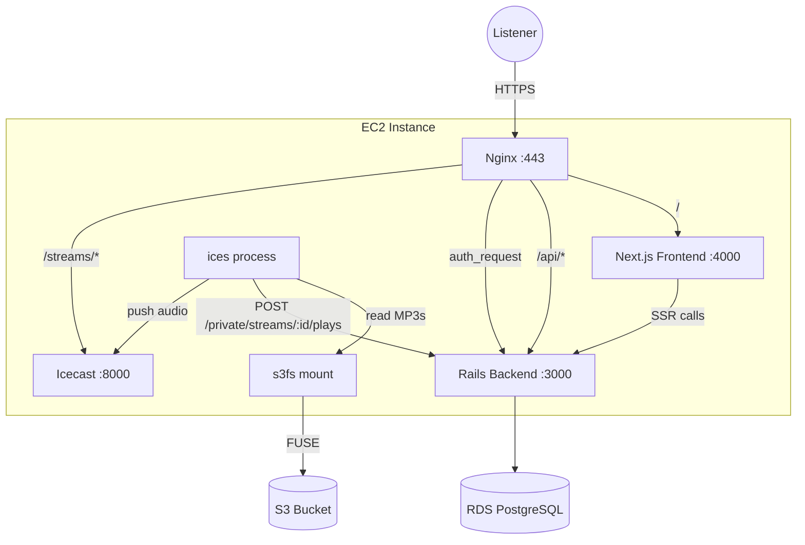
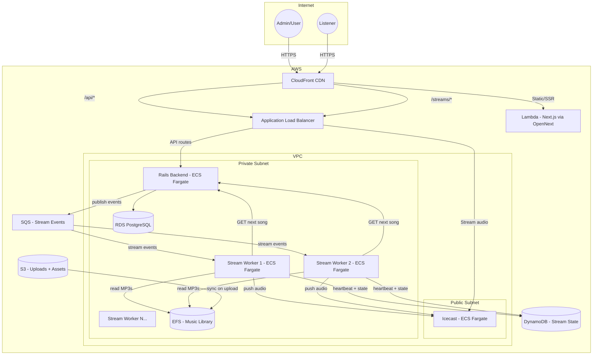
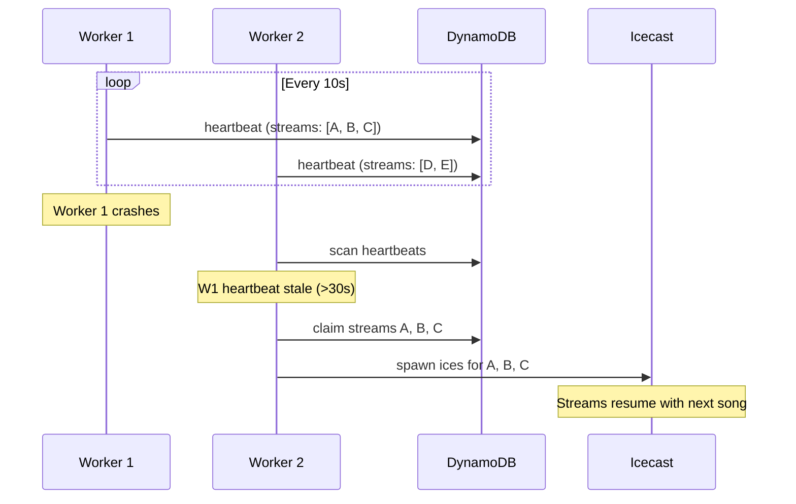
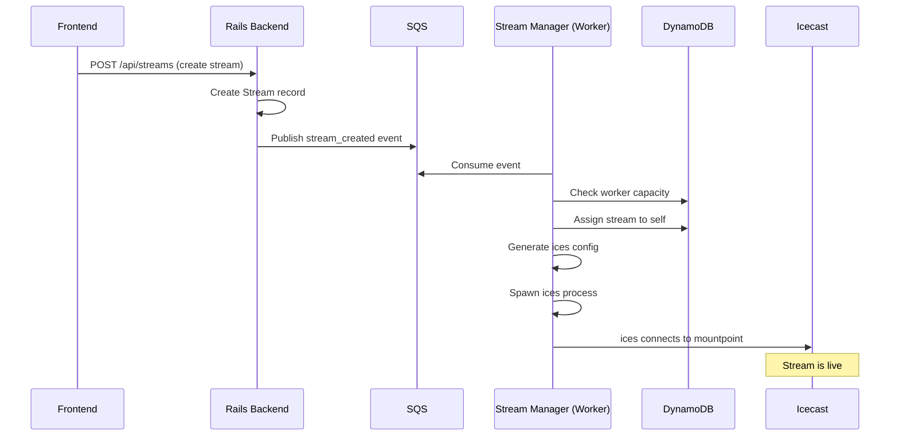

# ClaqRadio Architecture

## Current State

All services run on a single EC2 instance except PostgreSQL, which is on RDS. Nginx terminates SSL and reverse proxies to each service.

### Current Nginx Auth Flow

Nginx uses `auth_request` to protect Icecast streams. When a listener requests `/streams/<mountpoint>`:

1. Nginx sends an internal subrequest to `GET /private/auth` on the Rails backend
2. Rails checks whether the request is authorized (returns 200 or 401/403)
3. If authorized, Nginx proxies the request to Icecast on port 8000, rewriting `/streams/...` to `/...`

**Limitations of the current auth approach:**
- The auth check happens once at connection time. Once connected, the listener stays connected even if their session is revoked.
- The Rails backend is the single point of failure for both API and auth.
- No caching of auth results — every new listener connection hits Rails.
- Icecast is bound to localhost, so it's only accessible through Nginx. This is good for security but means scaling Icecast requires rethinking the proxy layer.

### How Ices Works

Each stream requires a running ices process. Ices calls a Perl module (`ClaqRadio.pm`) which:
1. POSTs to `{CLAQRADIO_STREAM_URL}/private/streams/{stream_id}/plays` on the Rails backend
2. Receives JSON with the next song path and metadata
3. Returns the file path to ices, which reads the MP3 and encodes/pushes to an Icecast mountpoint

Song selection is **stateless** — ices just asks for the next song when the current one finishes (~every 3-5 minutes).

---

## Target State

### Component Breakdown

#### Frontend (Lambda)

Next.js deployed via OpenNext/SST to AWS Lambda + CloudFront. This eliminates a persistent server for a workload that's inherently request-driven.

- CloudFront handles static assets, caching, and SSL termination
- Lambda handles SSR and API route proxying
- Cost: near-zero at low traffic, scales automatically

#### Backend (ECS Fargate)

Rails stays as a unified BFF and song-selection API. Runs as one or more Fargate tasks behind the ALB.

- Horizontally scalable — add tasks as stream count grows
- RDS PostgreSQL replaces the local database
- Publishes stream lifecycle events to SQS (existing behavior)

#### Stream Workers (ECS Fargate)

Each worker runs the **Go stream manager** with **multiple ices processes**. This is the most cost-effective approach — ices is very lightweight, so packing many per container avoids Fargate per-task overhead (~$9-10/month per task at 0.25 vCPU / 0.5 GB).

- The stream manager consumes SQS events and spawns/stops ices processes within its container
- Each worker writes a heartbeat to DynamoDB with its capacity and assigned streams
- New streams are assigned to the worker with the most headroom
- MP3s are read from the shared EFS mount

#### Icecast (ECS Fargate)

Starts as a single Fargate task. All ices workers push to it.

- Exposed to the internet via the ALB
- Future scaling path: Icecast relay topology (one master, multiple relays behind ALB)
- Auth moves from nginx `auth_request` to ALB + Lambda authorizer (see below)

#### Music Library (EFS)

Replaces s3fs. EFS is natively supported by Fargate and provides shared POSIX read access to all worker tasks.

- ~5 GB currently, very affordable on EFS
- Ingest pipeline: Upload hits S3 via the backend, a small Lambda copies to EFS and triggers metadata extraction
- Read-only for ices workers

#### Stream Auth (improved)

The current nginx `auth_request` pattern can be replaced with an **ALB + Lambda authorizer** or **CloudFront signed URLs**:

**Option A: ALB with Lambda authorizer (recommended)**
- A Lambda function validates the JWT/session on each new stream connection
- Authorized requests are forwarded to Icecast
- Auth results can be cached at the ALB level to reduce Lambda invocations
- Decouples auth from the Rails backend

**Option B: CloudFront signed URLs**
- The Rails backend generates a time-limited signed URL for each stream
- The frontend uses the signed URL to connect to the Icecast mountpoint via CloudFront
- No per-connection auth check needed — the URL itself is the credential
- Simpler, but URLs could be shared (mitigated with short expiry)

Either approach is more scalable and reliable than the current single-nginx setup.

### Warm Standby Failover

Workers do **not** run duplicate streams during normal operation. Instead:

1. Each worker writes a heartbeat to DynamoDB every ~10 seconds with its assigned stream list
2. All workers periodically scan for stale heartbeats (no update in ~30 seconds)
3. If a worker is detected as dead, surviving workers claim its orphaned streams from DynamoDB and respawn them
4. On failover, listeners experience a brief silence (up to one song length in worst case) before the stream resumes with the next song
5. The frontend player should implement auto-reconnect to handle this transparently

### Stream Assignment

When a new stream is created:

---

## Migration Plan

### Phase 1: Containerize (no infra changes yet)

**Goal**: Get Docker images building and tested locally without changing the production EC2 setup.

1. **Create Dockerfiles** for each service:
   - `radio-backend/Dockerfile` — Rails app
   - `radio-stream-manager/Dockerfile` — Go binary + ices + Perl modules + s3fs or EFS mount support
   - Icecast — use the official `icecast` Docker image
2. **Create a `docker-compose.yml`** at the workspace root for local development with all services
3. **Set up ECR repositories** for each image
4. **Set up CI/CD** to build and push images on merge to main

### Phase 2: Deploy frontend to Lambda

**Goal**: Move the frontend off the EC2 instance. This is independent of everything else and has the highest cost/simplicity payoff.

1. Set up SST or OpenNext for the Next.js app
2. Deploy to Lambda + CloudFront
3. Point DNS (Route 53) to CloudFront for the main domain
4. Update CloudFront to forward `/api/*` and `/streams/*` to the EC2 instance (or ALB once it exists)
5. Decommission the Next.js systemd service on EC2

### Phase 3: Backend to ECS Fargate

**Goal**: Move Rails off EC2.

1. Create an ECS cluster and Fargate task definition for the Rails backend
2. Set up an ALB with target groups for the backend
3. Deploy Rails to Fargate
4. Update CloudFront to route `/api/*` to the ALB
5. Implement stream auth as an ALB Lambda authorizer (replacing nginx `auth_request`)
6. Route `/streams/*` through ALB to Icecast (still on EC2 for now)
7. Decommission the Rails systemd service on EC2

### Phase 4: Music library to EFS

**Goal**: Replace s3fs with EFS for reliable shared storage.

1. Create an EFS file system in the VPC
2. Write a small Lambda triggered by S3 uploads to sync files to EFS
3. Mount EFS on the EC2 instance (for the still-running ices)
4. Verify ices reads from EFS correctly
5. Decommission s3fs

### Phase 5: Icecast + Stream Workers to Fargate

**Goal**: Move the streaming infrastructure off EC2. This is the final and most complex phase.

1. Deploy Icecast as a Fargate task, exposed via the ALB
2. Build the stream worker Docker image (stream manager + ices + Perl modules)
3. Deploy one stream worker to Fargate with EFS mounted
4. Migrate existing streams from EC2 ices to the Fargate worker
5. Verify end-to-end: stream creation -> SQS -> worker -> ices -> Icecast -> listener
6. Add a second worker to test warm standby failover
7. Decommission the EC2 instance

### Phase 6: Polish and harden

1. Add auto-reconnect to the frontend audio player
2. Add CloudWatch alarms for worker heartbeat staleness, Icecast health, EFS throughput
3. Set up auto-scaling policies for stream workers based on stream count
4. Document runbooks for common operations (adding capacity, debugging a stuck stream, manual failover)

---

## Cost Estimates (approximate, us-east-1)

| Component | Estimated Monthly Cost | Notes |
|---|---|---|
| Lambda (frontend) | $0-5 | Near-zero at low traffic |
| CloudFront | $1-5 | Depends on listener bandwidth |
| ECS Fargate (Rails, 0.25 vCPU / 0.5 GB) | ~$9 | One task, scale as needed |
| ECS Fargate (Icecast, 0.25 vCPU / 0.5 GB) | ~$9 | One task initially |
| ECS Fargate (stream workers) | ~$9-18 | 1-2 workers to start |
| RDS PostgreSQL | ~$15 | Already provisioned |
| EFS (5 GB) | ~$1.50 | Standard storage class |
| SQS | <$1 | Low message volume |
| DynamoDB (on-demand) | <$1 | Low read/write volume |
| S3 (5 GB + uploads) | <$1 | Existing cost |
| **Total** | **~$45-55** | |

The target architecture costs moderately more than the current setup but scales without re-architecture. The variable costs (Lambda, CloudFront, SQS) are negligible until you have significant traffic. The EC2 instance goes away entirely once migration is complete.
